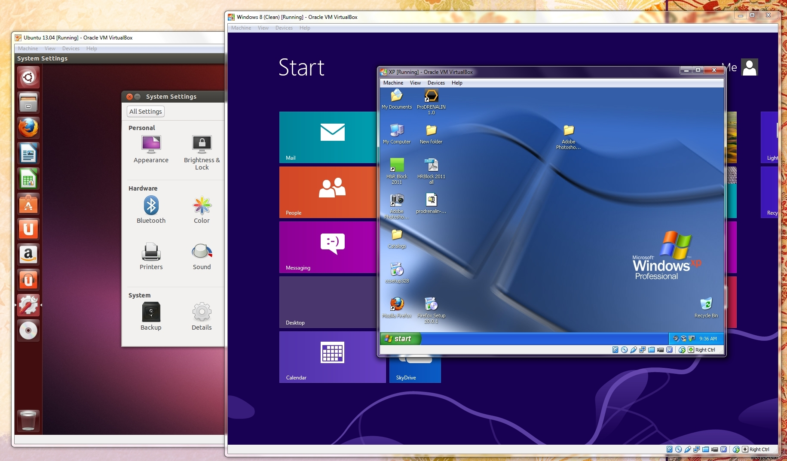

# Introducción a Docker

## Motivación

### En desarrollo e investigación

* Instalar y configurar es costoso
* Manejar dependencias es doloroso
* Un equipo puede tener diferencias vastas en sus ambientes de trabajo
* "En mi máquina corre"
* A pesar de herramientas como `virtualenv` y `packrat`, diferencias a nivel de sistema pueden causar dolores de cabeza
* Diferencias en versiones de herramientas y tecnologías pueden causar problemas de compatibilidad

### En producción

* Compartir y distribuir configuraciones y dependencias es difícil
* "En mi máquina corre"
* El ambiente de desarrollo o investigación nunca es exactamente igual al de producción
* Distribuir cambios puede ser extremadamente doloroso

Docker nos permite resolver estos problemas, pues provee una manera sencilla y portable de **construir y compartir ambientes completos**, además de que corre nativamente en cualquier servidor con Linux (y algunos con Windows), permitiendo su **completo acceso a los recursos del sistema**. Es posible también crear una red virtual para instancias de Docker, permitiendo aislar y escalar fácilmente cada parte de la infraestructura.

Además, a través de DockerHub, Docker provee la capacidad de utilizar ambientes creados por la comunidad, si la herramienta o tecnología es relativamente popular, seguramente existe en DockerHub.

Por último, orquestadores de contenedores como Kubernetes y Swarm nos permiten **manejar y escalar una infraestructura** basada en Docker.

En esta sesión veremos una explicación de alto nivel de cómo funciona Docker, haremos un _overview_ de sus características y conceptos, y aprenderemos a construir y correr una imagen de Docker

## Virtualización

Se refiere a un grupo de tecnologías que permiten crear **instancias virtuales** de componentes de hardware o software, permitiendo la interacción con ellos por parte del usuario u otros componentes. Ejemplos de virtualización incluyen máquinas virtuales (como VirtualBox),  contenedores (como los creados por Docker) y emuladores de consolas de videojuegos.

### Virtualización por _Hardware_

En este tipo de virtualización se crea una máquina virtual con cierto sistema operativo instalado. Esto se logra a través de un _hypervisor_ o _virtual machine monitor (VMM)_, que realiza una **emulación del hardware** requerido por el sistema operativo. Requiere determinar de antemano qué hardware será emulado y con qué características, y los recursos asignados a esa emulación serán los únicos recursos disponibles por la máquina virtual. 

Ya que la virtualización ocurre a nivel hardware, es posible tomar _snapshots_ del sistema completo, permitiendo su reanudación o funcionando como respaldo. La emulación del disco duro, RAM y BIOS puede ser "congelada" en un momento en el tiempo en archivos, permitiendo su posterior restauración.


La necesidad de emular por completo el hardware utilizado por el sistema operativo huésped implica cierto _overhead_ (gasto de recursos) constante para el _hypervisor_ y/o el sistema operativo anfitrión, por lo que una VM o emulador típicamente **no se desempeña con el mismo rendimiento que una máquina real**. En algunos casos, la dificultad de emular el _hardware_ que necesita un sistema operativo resulta en una máquina virtual con un comportamiento distinto que el de una máquina real con las mismas características. Además, los recursos deben reservarse de antemano.

Productos como VirtualBox y servicios como EC2 en AWS, así como emuladores de consolas de videojuegos como MAME o VisualBoyAdvance son los ejemplos más populares de este tipo de virtualización.



### Virtualización por _Software_

Por otro lado, la virtualización por software (la usada por Docker) **ocurre a nivel sistema operativo**. En esta tecnología, el núcleo o _kernel_ del sistema operativo permite la coexistencia de varios _userspaces_, aislados uno del otro pero compartiendo recursos del _kernel_. Estos _userspaces_ incluyen distintos archivos binarios y librerías que permiten correr programas dentro de ellos. Desde el punto de vista de estos programas, el _userspace_ es un sistema operativo completo.

Ya que no se requiere la instalación completa del _OS_, los **contenedores** resultado de esta técnica de virtualización ocupan menos espacio, tienen menos _overhead_ en su ejecución, y tienen acceso a todos los recursos del sistema, sin necesidad de reservarlos de antemano.


Una limitante es que es imposible virtualizar un _OS_ con un núcleo distinto al del anfritrión, aunque una solución común es realizar dicha virtualización dentro de una máquina virtual. Docker para Windows y Mac utiliza esta solución para virtualizar contenedores de Linux.

Por otro lado, el hecho de que los contenedores compartan recursos del sistema implica que **pueden canibalizarse unos a otros**, cuando varios contenedores demandan una gran cantidad de recursos.

## Características de Docker

* Virtualización a nivel software
* Disponible con **soporte nativo** para Linux y algunos Windows
* Disponible a través de **máquina virtual** para MacOS, otros Windows, y FreeBSD
* Disponible en los principales proveedores de cómputo en la nube (AWS, Google Cloud, Microsoft Azure)
* Portabilidad: Construye una vez, despliega donde sea
* Ambientes aislados pero comunicables a través de redes y volúmenes virtuales
* Construir imágenes a través de instrucciones en un archivo (Dockerfile)
* Un CLI completo para interactuar con nuestras imágenes y contenedores
* API REST con bindings oficiales para Python y Go. No oficiales para muchos más
* Almacenamiento en la nube a través de Docker Hub o _registry_ privado
* _Docker Compose_ nos permite configurar y desplegar infraestructuras completas
* _Docker Swarm_ nos permite mantener y escalar _clusters_ de contenedores

## Conceptos básicos de Docker

* **Docker Engine**: La aplicación cliente-servidor instalada en tu máquina, consiste de tres componentes principales

  * Un **servidor** o **demonio** que está corriendo continuamente (el comando `dockerd` o `service docker`), este servidor realiza la mayoría del trabajo
  * Un **API REST** para comunicarse con este demonio, el usuario o programa indica al demonio qué hacer a través de esta API
  * Un **CLI** (el comando `docker`) que abstrae el funcionamiento de esta API REST

  El servidor y cliente pueden encontrarse en la misma máquina, o un cliente se puede conectar a un servidor remoto.

* **Docker Hub**: El **_registry_** oficial de Docker, permite "jalar" y "empujar" imágenes públicas o privadas.

* **Registry**: Un repositorio de imágenes

* **Imagen**: Un ejecutable aislado y autónomo que contiene todo lo necesario para correr algún _software_, como código, librerías, binarios, variables de ambiente, etc. El _template_ de un contenedor.

* **Contenedor**: La instancia de una imagen. Una imagen una vez ejecutada resulta en un contenedor que corre la pieza de _software_ especificada en ella. Un contenedor está completamente aislado del anfitrión y de otros contenedores, accediendo sólo lo que se le comparte explícitamente

* **Dockerfile**: Un archivo que define una imagen

* **Servicio**: Un contenedor o grupo de contenedores provenientes de la misma imagen que **sirven** cierta pieza de _software_, por ejemplo, una base de datos. Definir servicios en docker ayuda a escalarlos de manera horizontal

* **Docker Compose**: Nos permite definir servicios para levantar una infraestructura completa

* **Docker Swarm**: Permite manejar y escalar grupos de contenedores. Estos contenedores pueden existir en un _cluster_ de máquinas conectadas a través de alguna red, o coexistir en la misma máquina.

## Comandos básicos del CLI

* `docker pull`: Obtiene una imagen de Docker Hub u otro registry
* `docker push`: Sube una imagen local a Docker Hub u otro registry
* `docker images`: Despliega todas las imágenes "instaladas" en nuestro sistema
* `docker run`: Corre alguna imagen en particular, creando un contenedor
* `docker ps`: Despliega todos nuestros contenedores activos 
* `docker stop`: Detiene uno o más contenedores
* `docker rm`: Remueve uno o más contenedores
* `docker rmi`: Remueve una o más imágenes
* `docker build`: Construye una imagen a partir de un Dockerfile
* `docker commit`: Crea una imagen a partir de cambios en un contenedor
* ¡Muchos más! Intenta correr `docker` a secas para ver todos

## Creando imágenes

Existen dos maneras principales de crear imágenes:

* A partir de los cambios realizados **manualmente** en un contenedor, con el comando `docker commit`
* A partir de la **definición** de un Dockerfile, con el comando `docker build` 

Ambas maneras de crear imágenes funcionan por **capas**. A partir de una imagen base, usamos `commit` o `build` para añadirle una o más capas a la imagen, que pueden consistir de correr comandos, agregar configuración o archivos, etc. Una vez creada la nueva imagen, puede servir como base para otra imagen.

El uso de`docker commit` es recomendable solamente para **cambios rápidos o temporales**, que no compartirás con otros miembros de un equipo o pondrás en producción. Es ideal para _hotfixes_ o instalación de paquetes en un ambiente de desarrollo. Ya que no existe manera de reconstruir la imagen ni se mantiene el registro de los cambios, **no debe usarse para producción ni para imágenes que serán distribuidas a un equipo**.

Por otro lado, las imágenes definidas en un Dockerfile sólo pueden ser creadas a través del comando `docker build`. Esta **es la manera ideal de definir una imagen** que será utilizada en producción o compartida con un equipo. Al mantener el registro exacto de los pasos a seguir para construir la imagen, provee **reproducibilidad**, una parte esencial, aunque a veces descuidada, de la ciencia de datos. Adicionalmente, si la imagen contuviese _software_ malicioso, su instalación sería un paso visible en el Dockerfile.

## Dockerfile, instrucciones básicas

Un Dockerfile es un archivo que define una imagen con una serie de **instrucciones**, estas instrucciones permiten correr comandos, agregar archivos de la máquina anfitrión, compartir volúmenes, etc

### #

Indica un comentario

### FROM

Indica la imagen base. Más capas se añadirán con las demás instrucciones. De no existir la imagen base en la máquina local al construir la imagen, se "jalará" de Docker Hub u otro registry como si se usara `docker pull`. Esta instrucción es **obligatoria** y debe ser la primera.

Ejemplo:

```
FROM ubuntu:latest
```


### RUN

Corre un comando sobre la última capa creada. Cada comando **RUN** genera una capa nueva sobre la cual se corren las instrucciones siguientes. Se ejecutan usando el shell default de la imagen base, a menos de que se especifique lo contrario. Hay dos maneras de usar esta instrucción:

* `RUN <command>` 
* `RUN ["executable", "param1", "param2"]`

Ejemplo:

```
FROM ubuntu:latest
RUN apt-get update
```

### CMD

Indica el **comando _default_** de la imagen, cuando se use `docker run` sin argumento `--entrypoint` o especificando un ejecutable se correra este comando. Puede usarse de tres maneras

* `CMD ["executable", "param1", "param2"] `


* ` CMD ["param1", "param2"]`


* `CMD <command>`

Si se especifica un _entrypoint_ se tomará la segunda manera. Sólo puede existir una instrucción **CMD** en un Dockerfile

Ejemplo:

```
FROM ubuntu:latest
CMD echo "Hola mundo!"
```

### ENV

Especifica el valor de una variable de ambiente. Esta variable se mantendrá en las instrucciones y capas subsecuentes hasta que sea cambiada por algún comando u otra instruccion **ENV**. El uso es:

* `ENV <key> <value> ` 

Ejemplo:

```
FROM ubuntu:latest
ENV PATH /usr/bin
```

### ADD

Copia carpetas, archivos locales o archivos remotos a la imagen. En caso de ser locales, se debe usar _paths_ relativos a la ubicación del Dockerfile. El uso es:

* `ADD <src> <dest>`

Ejemplo:

```
FROM ubuntu:latest
ADD un_archivo /data/mi_archivo
CMD ["cat", "/data/mi_archivo"]
```

**ADD** sigue varias reglas dependiendo de `<src>` y `<dest>`. Ver la [documentación completa](https://docs.docker.com/engine/reference/builder/#add). También existe la instrucción **COPY**, la cual es muy similar excepto que no aceptará archivos remotos (URL) como fuente.

### ENTRYPOINT

Dos maneras de usarlo:

* `ENTRYPOINT ["executable", "param1", "param2"]`
* `ENTRYPOINT command param1 param2`

Todos los argumentos pasados a `docker run <image>` después del nombre de la imagen serán enviados al entrypoint, y **sobreescribirán** a los argumentos definidos por **CMD**, de existir.

Ejemplo:

```
FROM ubuntu:latest
CMD ["arg1", "arg2"]
ENTRYPOINT ["echo"]
```

### VOLUME

Crea un punto de montaje para compartir archivos del contenedor hacia el anfitrión u otros contenedores. Su uso es:

* `VOLUME ["/logs"]`

Ejemplo:

```
FROM ubuntu:latest
VOLUME ["/logs", "/output"]
```

Los volúmenes así creados estarán disponibles en el anfitrión y podrán montarse en otros contenedores.

### WORKDIR

Indica el directorio de trabajo para la imagen. Todas las instrucciones subsecuentes partirán de este directorio de trabajo.

* `WORKDIR <path>`

Ejemplo:

```
FROM ubuntu:latest
ADD un_archivo /data/mi_archivo
WORKDIR /data
ENTRYPOINT ["cat", "mi_archivo"]
```

## Dockerfile _DIY_

Crea una imagen de ubuntu con `python` 3.5 de dos maneras distintas

* A partir de un contenedor, usando `docker commit`
* A partir de un Dockerfile, usando `docker build`

Para ver los detalles de cada comando, usa `--help`, por ejemplo `docker run --help`. Recuerda que puedes instalar paquetes usando `apt-get`.

**_Hint_ para docker commit**: `docker pull ubuntu; docker run -it ubuntu bash`

**_Hint_ para Dockerfile**: `FROM ubuntu` 

### Lo demás es vanidad:

Haz el mismo Dockerfile pero con las siguientes modificaciones (haz una o varias a la vez):

* Agrega un script de python que imprima "Hola Mundo!" a un archivo bajo la carpeta `/logs`  y agrega este script como `CMD` o `ENTRYPOINT` (Bonus: ¿cuál es mejor? ¿por qué?)
* Agrega un volumen en `/logs` y observa el resultado de correr tu imagen. **_Hint_**: usa `docker volume ls` y `docker volume inspect` para encontrar en dónde se montó la carpeta.
* Modifica tu script de python para imprimir varias líneas de "Hola Mundo!" de acuerdo a un argumento recibido por línea de comando. Agrega un _default_ para este argumento utilizando `CMD`


